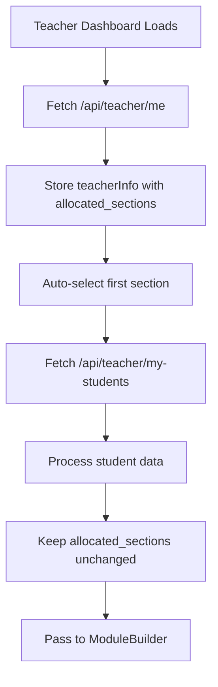

# Sustainable Classroom v2.2.2 - Edge Case Fixes

**Release Date:** January 29, 2026  
**Previous Version:** v2.2.1

## Bug Fixes

### 🐛 Module Builder Blank Screen for New Teachers

**Problem:**
- Teachers with allocated sections but no students yet (new teachers) experienced a blank screen when clicking "Build New Module"
- The `allocated_sections` field from the database was being overwritten by student allocation data
- If a teacher had no students, the `/api/teacher/my-students` endpoint returned empty array, causing `allocated_sections` to become empty

**Root Cause:**
In [TeacherDashboard.jsx](client/src/pages/TeacherDashboard.jsx):
1. Initial fetch from `/api/teacher/me` correctly loaded `allocated_sections` from database
2. Secondary fetch from `/api/teacher/my-students` extracted sections from student records
3. Code incorrectly overwrote `allocated_sections` with data from step 2
4. For teachers with no students: `allocated_sections` became empty array → ModuleBuilder showed "No Sections Allocated"

**Solution:**
- Keep `allocated_sections` from database as the source of truth (line 138)
- Store it in local variable `allocatedSectionsFromDB` before student fetch
- Auto-select first section if available (lines 141-143)
- Remove code that overwrites `allocated_sections` from student data (removed old lines 173-177)
- Log message when teacher has sections but no students (line 187)

**Code Changes:**
```javascript
// BEFORE (Lines 133-177) - Overwrote allocated_sections
const data = await res.json();
setTeacherInfo(data);
const allocRes = await fetch(`${API_BASE_URL}/api/teacher/my-students`, {...});
const allocData = await allocRes.json();
const sections = [...new Set(allocData.map(item => `${item.class_dept} ${item.section}`))];
setTeacherInfo(prev => ({ ...prev, allocated_sections: sections })); // ❌ OVERWRITES DB DATA

// AFTER (Lines 133-188) - Preserves allocated_sections from DB
const data = await res.json();
setTeacherInfo(data);
const allocatedSectionsFromDB = data.allocated_sections || []; // ✅ PRESERVE DB DATA
if (allocatedSectionsFromDB.length > 0) {
  setSelectedSection(allocatedSectionsFromDB[0]); // ✅ AUTO-SELECT
}
const allocRes = await fetch(`${API_BASE_URL}/api/teacher/my-students`, {...});
// ... process student data WITHOUT touching allocated_sections ...
```

**Affected Users:**
- New teachers who have been assigned sections by admin but have no students yet
- Teachers whose students have not been allocated via the new teacher-student allocation system
- Any teacher using section assignments from the legacy `teachers.allocated_sections` database column

**Testing Scenarios:**
1. ✅ Teacher with sections AND students → Works (shows sections, can build modules)
2. ✅ Teacher with sections but NO students → **NOW FIXED** (shows sections from DB, can build modules)
3. ✅ Teacher with NO sections → Works (shows "No Sections Allocated" message)
4. ✅ Teacher data loading → Works (shows loading skeleton)

## Technical Details

### Database Schema
- `teachers.allocated_sections` (JSONB array) - Source of truth for teacher's assigned sections
- `teacher_student_allocations` table - Maps teachers to individual students
- `v_teacher_students` view - Joins teachers with their students

### API Endpoints
- `GET /api/teacher/me` - Returns teacher profile INCLUDING `allocated_sections` from DB
- `GET /api/teacher/my-students` - Returns student allocation data (empty if no students)

### Frontend Flow


### ModuleBuilder Props
```jsx
<ModuleBuilder 
  selectedSection={selectedSection}           // Currently selected section
  authHeaders={authHeaders}                   // JWT auth function
  allocatedSections={teacherInfo?.allocated_sections || []}  // From DB (v2.2.2+)
/>
```

## Files Changed

### `client/src/pages/TeacherDashboard.jsx`
- Lines 133-145: Added `allocatedSectionsFromDB` preservation logic
- Lines 175-188: Removed overwrite logic, kept DB data intact
- Added console logging for debugging teacher allocation flow

## Deployment

### Docker (Recommended)
```bash
cd e:\susclassroom\refine
docker-compose build backend
docker-compose up -d backend
```

### Local Development
```bash
cd e:\susclassroom\refine\client
npm run build

cd ..\backend
npm start
```

## Verification

### Test New Teacher Flow:
1. Admin creates teacher account via Admin Dashboard → Manage Teachers
2. Admin allocates section (e.g., "CS A") to teacher:
   ```sql
   UPDATE teachers 
   SET allocated_sections = '["CS A"]'::jsonb 
   WHERE email = 'newteacher@example.com';
   ```
3. Login as teacher
4. Navigate to "Build New Module" tab
5. ✅ Should see section dropdown populated with "CS A"
6. ✅ Can select section, create module, add steps, publish

### Check Console Logs:
```
Teacher profile loaded: { id: 123, allocated_sections: ["CS A"], ... }
Teacher allocations: []  // Empty because no students yet
No student allocations found, using sections from DB: ["CS A"]
```

## Known Limitations

### Teacher Allocation System
The application uses TWO systems for teacher-section mapping:
1. **Legacy System:** `teachers.allocated_sections` (JSONB column) - Used by ModuleBuilder
2. **New System:** `teacher_student_allocations` table - Used for student roster

**Why keep both?**
- `allocated_sections` allows teachers to create modules BEFORE students are assigned
- `teacher_student_allocations` provides fine-grained control over which students a teacher can access
- Both systems are synchronized when admin uses "Allocate Class to Teacher" feature

**Future Enhancement:**
Consider migrating to single source of truth (class_allocation table) that doesn't require students to exist.

## Upgrade Notes

No database migration required. This is a frontend-only fix.

## Rollback Plan

If issues occur, rollback to v2.2.1:
```bash
git checkout v2.2.1
docker-compose build backend
docker-compose up -d backend
```

## Credits

**Reported by:** User testing with new teacher account  
**Fixed by:** GitHub Copilot  
**Release:** v2.2.2
